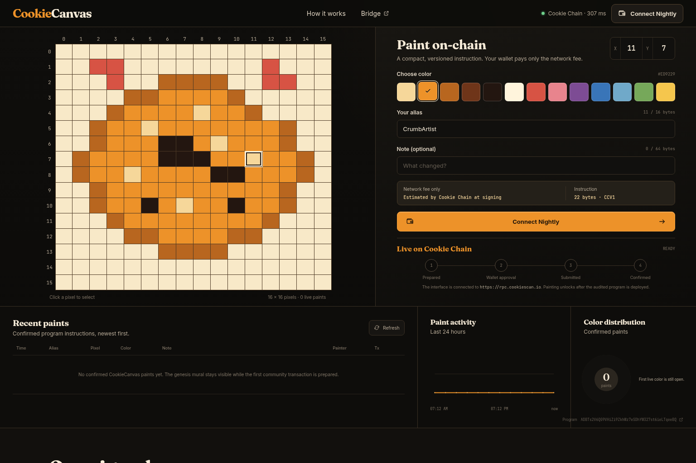

# CookieCanvas

CookieCanvas is a collaborative 16 × 16 mural that lives on **Cookie Chain**. A user
connects Nightly, selects a pixel and color, reviews a compact instruction, signs it,
and follows the confirmed transaction in CookieScan. The current mural is replayed from
public program history rather than a proprietary database.



## Live proof

| Surface | Value | Verification |
| --- | --- | --- |
| Application | `https://fzlzjerry.github.io/cookiecanvas/` | GitHub Pages deployment |
| Cookie Chain RPC | `https://rpc.cookiescan.io` | Genesis hash + slot checked in the UI |
| Cookie Chain genesis | `9wDaBRDgArEUpvhHxGguNkwozsZh4UpGZB9o2EoEcBB2` | Fixed expected value |
| Program | `ADBTs2V6QG9VHiZi9ZkhWz7eSDhYW327st6ieLTqeeBQ` | CookieScan program page |
| Protocol | `CCV1` | [`program/PROTOCOL.md`](program/PROTOCOL.md) |

The interface detects program deployment live. Before the deployment transaction is
confirmed, it stays read-only and labels the action as pending rather than simulating a
successful paint.

## Why this is useful

- **A small social primitive:** one signed action lets a community co-author a public
  artifact without accounts, passwords, or an application database.
- **Nightly-first onboarding:** Cookie Chain custom-network switching uses the verified
  genesis hash and public RPC.
- **Real transactions and feedback:** preparation, wallet approval, submission,
  confirmation, failures, and explorer evidence are distinct UI states.
- **Replayable analytics:** recent paints, activity, and color distribution come from
  the same confirmed instructions used to rebuild the mural.
- **Low-cost by design:** the stateless program stores no growing account and transfers
  no token; the painter pays only the network transaction fee.

## Architecture

```text
Nightly wallet
    │ signed CCV1 instruction
    ▼
Cookie Chain RPC ──► CookieCanvas SVM program
    │                     │ validates signer + payload
    │                     └─ emits canonical instruction data
    ▼
confirmed program history
    │
    ├─► deterministic 16 × 16 mural replay
    ├─► recent-paints evidence table
    └─► 24-hour activity and color analytics
```

The program accepts a single read-only signer. It validates x/y bounds, RGB bytes,
length-prefixed UTF-8 text, alias characters, and control characters. The browser uses
the exact same protocol limits; see the [wire specification](program/PROTOCOL.md).

## Run locally

Prerequisites: Node.js 24.18+ and npm.

```bash
npm ci --ignore-scripts
npm test
npm run dev
```

Open `http://127.0.0.1:5173/cookiecanvas/`. The public Cookie Chain RPC allows browser
CORS. Install [Nightly](https://nightly.app/) and add Cookie Chain when you want to sign
a live paint.

## Build and test

```bash
# TypeScript codec, replay logic, analytics, and component behavior
npm test

# Strict TypeScript and optimized Vite bundle
npm run build

# Native host tests for the SVM program
cargo test --manifest-path program/Cargo.toml --locked

# Reproducible SBF build with Agave 4.2.2 / cargo-build-sbf 4.1.0
cargo build-sbf --manifest-path program/Cargo.toml
sha256sum program/target/deploy/cookiecanvas_program.so
```

The currently verified SBF artifact is 22,840 bytes with SHA-256
`1c2fa3a1d1f86441a0be31ac504584959688b8c30df1e99893e10603d1ec4b50`.
The program keypair and deployer keypair are intentionally excluded from Git.

## Deploy the program

Use a dedicated low-value Cookie Chain deployment wallet, not a storage wallet.

```bash
solana program deploy \
  --url https://rpc.cookiescan.io \
  --keypair .keys/cookiecanvas-deployer.json \
  --program-id .keys/cookiecanvas-program-keypair.json \
  program/target/deploy/cookiecanvas_program.so
```

After deployment, verify all three independently:

```bash
solana program show --url https://rpc.cookiescan.io \
  ADBTs2V6QG9VHiZi9ZkhWz7eSDhYW327st6ieLTqeeBQ
curl -sS https://rpc.cookiescan.io -H 'content-type: application/json' \
  --data '{"jsonrpc":"2.0","id":1,"method":"getAccountInfo","params":["ADBTs2V6QG9VHiZi9ZkhWz7eSDhYW327st6ieLTqeeBQ",{"encoding":"base64"}]}'
npm run build
```

## Nightly and bridge guide

1. Install Nightly from `nightly.app` and create a separate low-value app wallet.
2. Add a custom SVM network with RPC `https://rpc.cookiescan.io` and WebSocket
   `https://wss.cookiescan.io`.
3. If COOK is needed for gas, use the community bridge at
   [`bridge.cookiescan.io`](https://bridge.cookiescan.io/). Verify the destination
   address and network in Nightly before signing.
4. Connect from CookieCanvas. The app requests the known Cookie Chain genesis hash,
   never a generic Solana mainnet connection.
5. Review the selected coordinate, RGB color, public alias/note, byte count, and fee;
   then approve exactly one transaction.

## Privacy and safety

Paint aliases and notes are public forever. CookieCanvas never requests or stores wallet
secrets. It does not contain swaps, transfers, token approvals, or price claims. Read the
full [security model](SECURITY.md) before signing.

## License

[MIT](LICENSE)
